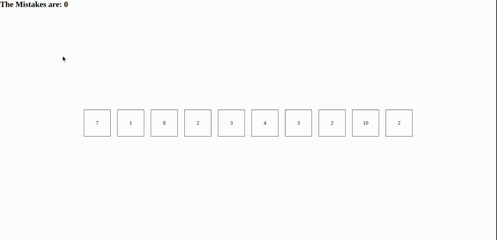

# Mahjong game

**[Test this app yourself](https://sgujuluva.github.io/mahjong-game/)**

---

### About Project

Mahjong is a Game application. There are 10 boxes with random numbers inside between 1 to 10. You have to click 2 boxes and if the number is same, the 2 boxes will be removed . If not , then the mistakes counter will increase. This game continues till last 2 boxes which is not same.

##### Developed With

- [x] _HTML5_
- [x] _CSS3_
- [ ] _SASS_
- [ ] _SCSS_
- [x] _JavaScript_
- [ ] _React_
- [ ] _Bootstrap_
- [ ] _npm_

---

### Contact

Mail: <sanghee04@gmail.com> 
GitHub: [sgujuluva](https://github.com/) 

---

Made with ❤️ by me
